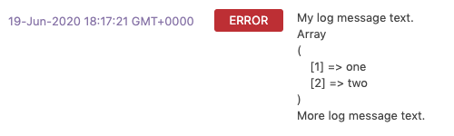

# WP Log
A log system plugin for WordPress custom child themes and custom plugins.

## Setup
1. Upload to your WordPress plugin directory and active it in the WordPress admin just like any plugin. 
2. Add this to your custom child theme or plugin:
    
    /**
     * Setup for the WP Log plugin
     */
    
    function wpl( $type, $title, $content ) {
        if ( function_exists('wpl_create_log_entry') ) {
            wpl_create_log_entry($type, $title, $content);
        }
        else {
            error_log('Function not found: wpl_create_log_entry()');
        }
    }
    
3. Install the [Custom Post Type UI](https://wordpress.org/plugins/custom-post-type-ui/) WordPress plugin. (Using the [Custom Post Type UI](https://wordpress.org/plugins/custom-post-type-ui/) plugin for now but it will be built-in in the future).

4. Copy/paste the below JSON into [Custom Post Type UI](https://wordpress.org/plugins/custom-post-type-ui/) - CPT UI > Tools > Post Types: Import Post Types.

    {"log":{"name":"log","label":"Log","singular_label":"Log","description":"","public":"true","publicly_queryable":"true","show_ui":"true","show_in_nav_menus":"true","delete_with_user":"false","show_in_rest":"true","rest_base":"logs","rest_controller_class":"","has_archive":"true","has_archive_string":"","exclude_from_search":"false","capability_type":"post","hierarchical":"false","rewrite":"true","rewrite_slug":"","rewrite_withfront":"true","query_var":"true","query_var_slug":"","menu_position":"","show_in_menu":"false","show_in_menu_string":"","menu_icon":"","supports":["title","editor"],"taxonomies":[],"labels":{"menu_name":"","all_items":"","add_new":"","add_new_item":"","edit_item":"","new_item":"","view_item":"","view_items":"","search_items":"","not_found":"","not_found_in_trash":"","parent_item_colon":"","featured_image":"","set_featured_image":"","remove_featured_image":"","use_featured_image":"","archives":"","insert_into_item":"","uploaded_to_this_item":"","filter_items_list":"","items_list_navigation":"","items_list":"","attributes":"","name_admin_bar":"","item_published":"","item_published_privately":"","item_reverted_to_draft":"","item_scheduled":"","item_updated":""},"custom_supports":""}}

## Create a log entry 

    wpl( 'error', 'This is my title', 'This is my log data.' );

Pass a string, array or object through the $content arg.
    
If it's a mix of strings, array and or objects use print_r like this:
    
    $content = print_r(array('one', 'two'), true) . ' More log message text.;
    
    wpl( 'error', 'My log message text.', $content );
    

The above will appear something like this in the log:

Log entry types are:
 - error
 - warning
 - info
 - success
 - test
